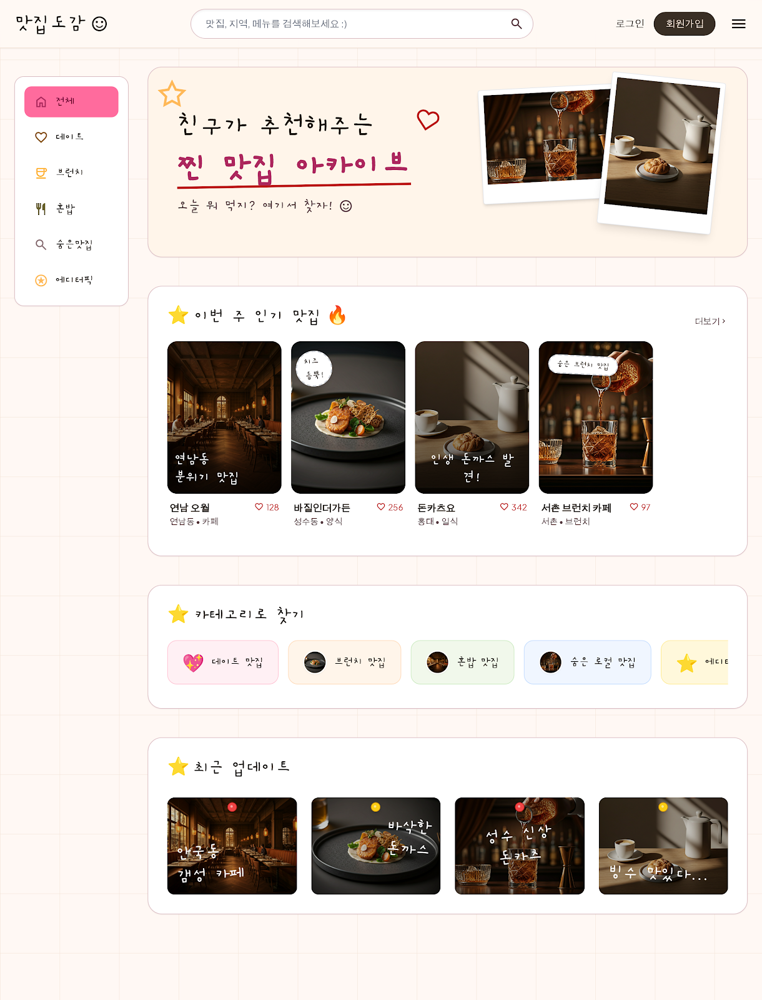
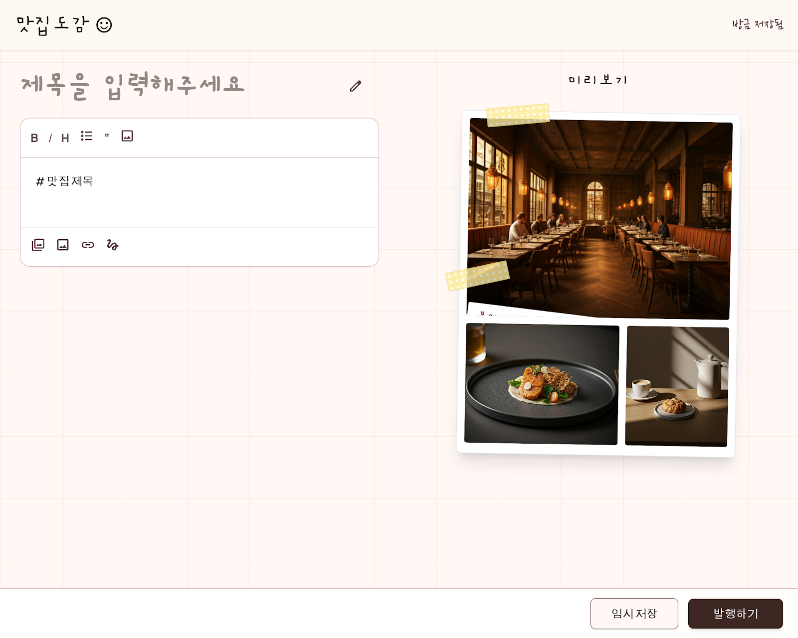
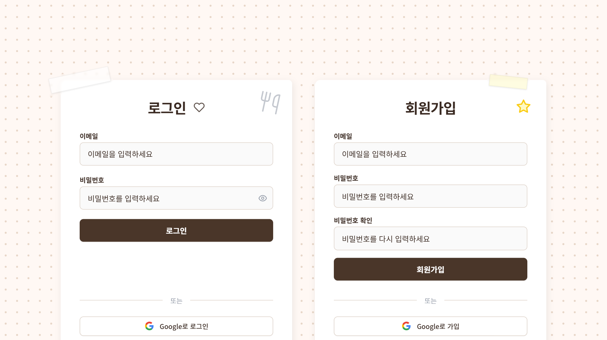
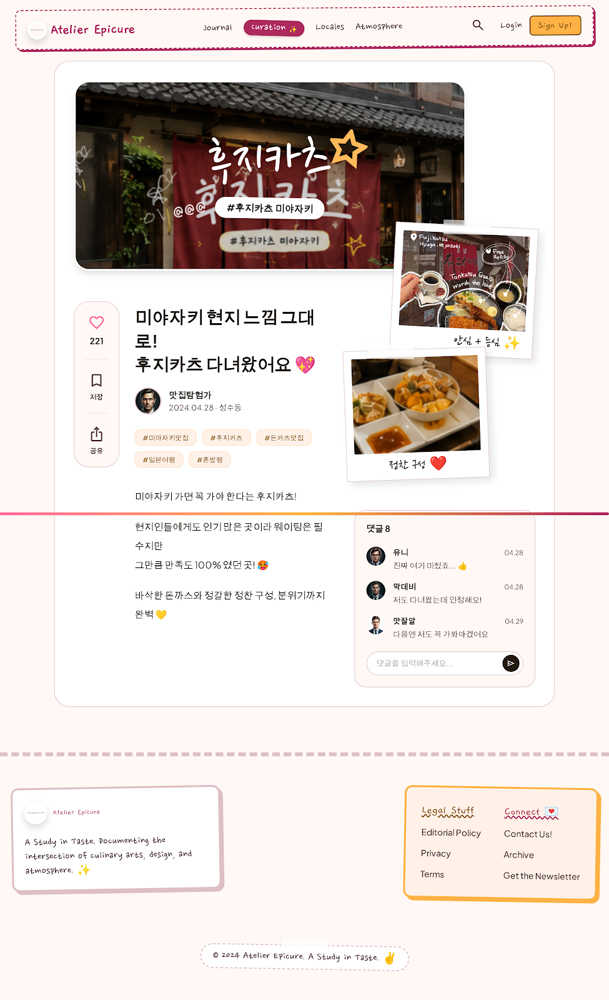

# Blog 만들기 

---

## 🛠️ 적용 기술 스택 (Tech Stack)

### 프론트엔드 (Frontend)
*   **Next.js (v16.2.6)**: App Router 및 Turbopack 빌드 최적화 기술을 사용하여 고속의 페이지 라우팅(Routing)을 수행합니다.
*   **React (v19.2.4)**: 서버 컴포넌트(Server Components)와 클라이언트 컴포넌트(Client Components)의 유기적 결합으로 초기 로딩 속도를 향상했습니다.
*   **Tailwind CSS (v4)**: 빌트인 테마 변수를 이용해 Kitsch 테마 컬러 및 감성 요소(모눈종이 배경, 3D 카드 기울기, 스티커 지글 애니메이션 등)를 컴포넌트 단위 스타일링했습니다.
*   **Material Symbols**: 아기자기한 손그림 느낌의 아이콘 메타포를 화면 곳곳에 배치했습니다.

### 백엔드 & 인프라 (Backend & Infra)
*   **Supabase (PostgreSQL)**: 실시간 클라이언트 SDK(Client SDK) 및 SSR 지원 미들웨어 환경을 활용하여 실시간 맛집 데이터베이스 및 세션 처리를 담당합니다.
*   **Row-Level Security (RLS)**: 데이터베이스(Database) 수준에서 정교한 행 단위 보안 접근 제한 정책을 수립했습니다.

---

## 🔒 Supabase 및 Row-Level Security (RLS) 정책
Supabase PostgreSQL의 강인한 **행 레벨 보안 (RLS, Row-Level Security)** 기능을 활성화하여 테이블에 접근하는 사용자별 권한을 엄격히 제어합니다.

```sql
-- 1. RLS 활성화
ALTER TABLE public.posts ENABLE ROW LEVEL SECURITY;

-- 2. 누구나 조회(SELECT) 가능 정책
CREATE POLICY "Allow public read access" ON public.posts
    FOR SELECT USING (true);

-- 3. 인증된(로그인한) 사용자만 새 글 추가(INSERT) 가능 정책
CREATE POLICY "Allow authenticated insert" ON public.posts
    FOR INSERT WITH CHECK (auth.uid() IS NOT NULL);

-- 4. 좋아요(Likes) 카운트의 자유로운 증가를 위한 무제한 수정(UPDATE) 정책
CREATE POLICY "Allow public update access" ON public.posts
    FOR UPDATE USING (true) WITH CHECK (true);
```

---

## ✨ 핵심 기능 설계 & 관련 기술 매칭 (Core Features)

### 1. 게시글 CRUD (Create, Read, Update, Delete)
*   **설명**: 사용자가 맛집 정보(식당 이름, 위치, 카테고리, 대표 사진, 감성 코멘트, 본문 내용)를 다이어리에 스크랩 및 추가하고 조회할 수 있는 기능입니다.
*   **매칭 기술**: Supabase Database API 연동. 서버 컴포넌트 및 클라이언트 SDK를 결합하여 비동기 데이터 로딩 및 `INSERT` 쿼리를 제어합니다.

### 2. 댓글 시스템 (Diary Notes)
*   **설명**: 각 맛집 포스트 하단에 친구들이 메모를 남기는 아기자기한 다이어리 노트 댓글란입니다.
*   **매칭 기술**: React 19 State Management. 로컬 상태 관리 기반의 다이내믹 렌더링으로 댓글이 등록될 때 귀여운 딜레이 모션과 프로필 아바타 매핑을 지원합니다.

### 3. 좋아요 기능 (Optimistic Likes)
*   **설명**: 마음에 드는 맛집 카드의 하트 아이콘을 누르면 즉시 좋아요 카운트가 상승합니다.
*   **매칭 기술**: 서버의 응답을 기다리지 않고 화면의 좋아요 수 카운트를 즉시 올린 후 백그라운드에서 Supabase UPDATE API를 호출하여 최상의 반응성(60fps)을 보장합니다.

### 4. 검색 기능 (Real-time Filtering)
*   **설명**: 메인 헤더의 입력창을 통해 제목, 카테고리, 위치, 스티커 태그 명을 실시간으로 검색하여 일치하는 다이어리 목록만 필터링합니다.
*   **매칭 기술**: Client-side Array Filtering. 사용자가 입력할 때마다 상태를 트리거하여 대소문자 구분 없이 신속하게 맛집 리스트를 재구성합니다.

### 5. 사용자 인증 기능 (Auth Session)
*   **설명**: 개별 사용자를 구분하기 위해 다이어리 주인 전용 로그인(Login) 및 회원가입(Sign Up), 로그아웃 처리를 제공합니다.
*   **매칭 기술**: **Supabase Auth & Next.js Middleware**. 쿠키(Cookie) 기반의 유저 세션 관리와 SSR 미들웨어 라우팅 제한을 연계하여 보완된 로그인 환경을 구현했습니다.

---

## 📱 페이지별 디자인 시안 매칭 및 구현 설명 (Pages & Designs)

### 1. 메인 홈 화면 (Main Home)

*   **적용 기술**: `Next.js Client Component`, `Tailwind CSS 3D Transforms`
*   **상세 설명**: 
    *   **헤더**: 브랜드 로고("예원's 맛집도감 😊"), 둥근 검색바 및 로그인/회원가입 제어 버튼과 햄버거 메뉴를 배치했습니다.
    *   **사이드바**: 가구체(`font-gaegu`)가 적용된 세로형 카테고리 메뉴("전체", "데이트", "브런치", "혼밥", "숨은맛집", "에디터픽")로 신속한 목록 필터링을 지원합니다.
    *   **인기 맛집**: 폴라로이드 사진 느낌의 카드 덱 레이아웃을 구현했으며, 카드 마우스 호버 시 **3D 기울기 효과(Card Tilt Effect)**와 노란색 땡땡이 테이프(`.washi-tape-yellow`) 데코를 얹었습니다.

### 2. 새 글 작성 화면 (Create Post)

*   **적용 기술**: `React Ref / Textarea Selection Range API`, `Local Storage API`
*   **상세 설명**:
    *   **에디터 영역 (좌측)**: 삐뚤빼뚤 폼 입력창 밑줄(`.input-squiggly`)과 마크다운 툴바(Bold, Italic, Bullet List 등)를 지원하여 일기장에 필기하는 감성을 살렸습니다.
    *   **미리보기 영역 (우측)**: 3장의 폴라로이드 사진이 마스킹 테이프로 찢겨 붙은 듯한 **3중 폴라로이드 레이아웃(큰 사진 1개 + 작은 사진 2개)** 실시간 프리뷰를 완성했습니다.
    *   **임시 저장**: 작성 중 브라우저가 종료되어도 안전하도록 **로컬 스토리지(Local Storage)** 자동 임시저장 기능을 구현했습니다.

### 3. 로그인 및 회원가입 화면 (Auth Portal)

*   **적용 기술**: `Next.js Dynamic SearchParams`, `Supabase server-side actions`
*   **상세 설명**:
    *   **배경**: 미세 도트 땡땡이 패턴(`.login-bg`)의 배경 레이아웃을 적용했습니다.
    *   **카드 분기**: 화면 낭비를 줄이고 시인성을 극대화하기 위해 URL 쿼리 파라미터(`?mode=signup` 등)에 맞추어 하나의 카드만 중앙에 단독 노출시킵니다.
    *   **하단 링크**: 로그인과 회원가입 간 전환 버튼을 통해 화면 새로고침 없이 유기적인 폼 전환이 일어납니다.

### 4. 글 상세 보기 화면 (Detail View)

*   **적용 기술**: `Sticky Navigation CSS`, `PostgreSQL Table Join`
*   **상세 설명**:
    *   **헤더**: "Atelier Epicure" 로고와 정갈한 영문 메뉴 라인, 둥근 서치 아이콘이 담긴 독립 테마 헤더를 배치했습니다.
    *   **히어로 배너**: 큼직한 맛집 대표 사진 위에 해시태그 스티커 오버레이를 얹어 화려한 키치 감성을 제공합니다.
    *   **좌측 스티키 바**: 화면 스크롤 시에도 좌측에 항상 따라다니는 공감(좋아요), 북마크, 공유용 수직 라운드 스티키 바를 제공합니다.
    *   **우측 데코 & 댓글**: "안심+등심", "정찬 구성" 폴라로이드 서브 사진들과 다이어리 노트(댓글) 박스, 그리고 감성 가득한 3단 카드의 푸터 레이아웃을 이식했습니다.
